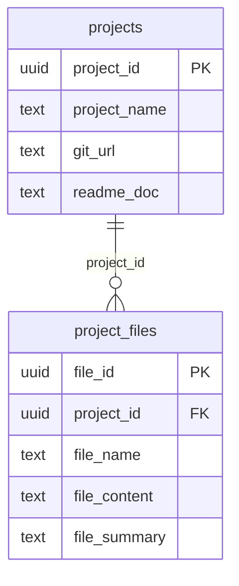

# Project README

## Overview
This FastAPI application streamlines the management of Git repositories by facilitating cloning, code aggregation, and automated README file generation. It enhances project documentation and management, making it easier for developers to maintain and understand their codebases.

## Tech Stack
- **Backend**: FastAPI
- **Database**: Supabase
- **Frontend**: Streamlit
- **Utilities**: Pydantic, dotenv, langchain, git library

## Project Structure
```
src/
├── main.py               # FastAPI application entry point
├── models/               # Data models for requests and database
│   ├── request.py
│   └── supabase/
│       ├── models.py     # Pydantic models for Supabase
│       └── database.py   # Database interaction utilities
├── utility/              # Utility functions for various tasks
│   ├── config.py         # Configuration settings
│   ├── file_crawler.py   # Code file aggregation
│   ├── git.py            # Git repository cloning utilities
│   ├── llm_util.py       # README generation utilities
│   ├── path.py           # Path management utilities
│   └── preprocess_file.py # File preprocessing utilities
UI/
├── app.py                # Streamlit UI for project management
└── helper.py             # UI components for file interaction
```

## Key Components/Modules/Database-Schema
- **main.py**: Manages API routes for repository cloning, project listing, and README retrieval.
- **models/request.py**: Defines the `RepoRequest` model for validating incoming requests.
- **utility/**: Contains various utilities for file handling, Git operations, and README generation.
- **supabase/models.py**: Defines data models for projects and files.
- **supabase/database.py**: Handles database interactions for saving and retrieving project data.

## Setup
1. **Create a virtual environment**:
   ```bash
   python -m venv venv
   source venv/bin/activate  # On Windows use `venv\Scripts\activate`
   OR
   Use UV package manager
   uv venv .venv
   ```
2. **Install dependencies**:
   ```bash
   pip install -r requirements.txt
   OR
   uv add -r requirements.txt --active
   ```

## Usage
### Run the Application
```bash
uvicorn src.main:app --reload # For Backend
streamlit run app.py # For Frontend
```

# Database Schema

This schema defines two related tables — **projects** and **project_files** — used to manage project metadata and associated file details. Each project can have multiple files, and all updates automatically track timestamps via triggers.

---

## Tables

### **projects**
| Column | Type | Default | Description |
|--------|------|----------|--------------|
| project_id | uuid | `gen_random_uuid()` | Primary key |
| project_name | text | — | Project name |
| git_url | text | — | Git repository URL |
| readme_doc | text | — | README contents |
| created_at | timestamptz | `now()` | Creation timestamp |
| updated_at | timestamptz | `now()` | Auto-updated on modification |

**Trigger:** `projects_updated_at` → `handle_updated_at()`

---

### **project_files**
| Column | Type | Default | Description |
|--------|------|----------|--------------|
| file_id | uuid | `gen_random_uuid()` | Primary key |
| project_id | uuid | — | Foreign key → `projects(project_id)` (ON DELETE CASCADE) |
| file_name | text | — | File name |
| file_content | text | — | Full file content |
| file_summary | text | — | Summary or extracted metadata |
| created_at | timestamptz | `now()` | Creation timestamp |

**Indexes:**
- `project_files_project_id_idx`
- `project_files_project_id_filename_idx`

**Trigger:** `project_files_updated_at` → `handle_updated_at()`

---

## Relationship


### API Endpoints
- **Health Check**: `GET /`
- **Clone Repository & Generate README**: `POST /repo`
- **List Projects**: `GET /projects`
- **Get Project Files**: `GET /projects/{project_id}/files`
- **Get Project README**: `GET /projects/{project_id}/readme`

## Configuration
| NAME                | Purpose                                  | Required | Default  |
|---------------------|------------------------------------------|----------|----------|
| SUPABASE_URL        | URL for Supabase database                | Yes      |          |
| SUPABASE_KEY        | API key for Supabase                     | Yes      |          |
| OPENAI_API_KEY      | API key for OpenAI                       | Yes      |          |

## Data Model
- **Project**: Represents a project with attributes like ID, name, Git URL, and README document.
- **ProjectFile**: Represents files associated with a project, including ID, project ID, file name, content, and summary.

## Testing
To run tests, ensure you have the testing dependencies installed and execute:
```bash
pytest
```

## Deployment
Consider using Docker for containerization. Configure CI/CD pipelines for automated deployment to cloud services like AWS or DigitalOcean.

## Roadmap/Limitations
- **Future Enhancements**: Integration with additional version control systems, improved error handling, and user authentication.
- **Limitations**: Currently supports only specific programming languages for summarization; further extensions may be needed for broader compatibility. 

This README provides a concise overview of the project, its components, and how to get started. For further details, please refer to the code and comments within the modules.

